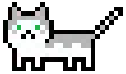

<p align="center">
  
</p>
<p align="center">A pixelated random cat generator!</p>

## How to run it

```bash
$ docker compose up
```

## Resources

The project has an authentication module where you can register a user and retrieve access and refresh tokens

```
POST /auth/login HTTP/1.1

{ "email": "example@example.com", "password": "apassword"}

Response:
{
	"access_token": "eyJhbGciOi...",
	"refresh_token": "eyJhbGciOi..."
}
```

### Duration of tokens

As of now, access tokens last 60 seconds, and can be refreshed
The refresh token lasts 15 minutes, and can be used to retrieve a new pair utilizing the /auth/refresh endpoint

## The main gist of it

After a user is created and authenticated, he can make a POST request to the /cats endpoint and generated his own random pixelated friend. The cat can have a range of different features, such as having one or two colors (for now), having it's pawns being a different color from the body, having heterochromia or not, and the colors of each of those features are random and selected from a few different rarity pools.

Here's a couple of randomly generated cats:

<p align="center">
  
	
	
	
</p>

## How does it work?

**This is under construction**
